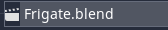
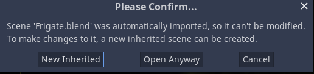
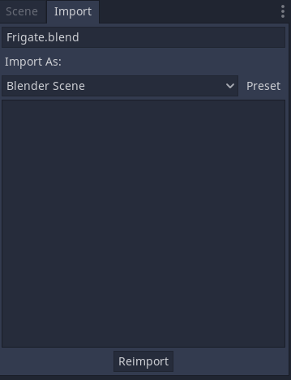

# Godot Blender Auto-import
Automatically import & update scenes when blender files are edited within the Godot project. Only works for Godot 3.4.4 and higher due to a reliance on **PackedSceneGLTF** which only exists in the latest version of Godot. 

## Installation
1. Download the source code and drag it into your Godot project. It should be located at the root `res://`
2. Check that you now have the `res://addons/BlenderAutoImport/` in your project along will all associated .cs files and a `plugin.cfg` file. 
3. Build your project. C# support in Godot 3 is... iffy so you need to build your project so that the assemblies exist in order for the plugin to be enabled. 
4. Project > Project Settings > Plugins 
	- Update
	- Enable **Blender Auto-import**

## Usage
1. Open blender
2. Create model
3. Save to godot project res://&lowast;&lowast;/&lowast;.blend
4. Wait for import to be complete, your blender file should show up as a scene asset
   

5. Double click the asset to open a new inherited scene for editing

6. You can reimport at any time

## How does it work? STEPS.
The plugin is actually fairly simple and follows the following 3 steps. 

### Locate Blender
The first step is to locate an installation of Blender 3D. It does this by checking common places where it could be located (like on the PATH, or from a Steam install). 

### Export GLTF
Once located, blender is invoked in background mode. It opens the .blend file and runs the python script `export.py` located at the root of this repository. This script simple calls the gltf exporter in blender with some defaults and creates a gltf binary file (.glb). This newly exported .glb file is saved into `res://.import`. 

During this part of the plugin, we have to translate Godot's `res://` file paths to system absolute file paths which can be sent to Blender. This is done using `System.Environment.CurrentDirectory` which defaults to the Godot project directory root (the same as res:// does). 

### Convert to a Scene
Now that we have a .glb file which Godot knows how to work with, we use the `PackedSceneGLTF` class, specifically its `ImportGltfScene` method to create a PackedScene resource which is also saved into `res://.import`. This is the scene file that is actually associated with the blender file. When you double click on the .blend file this file is actually the one that is opened in the background. 

## Notice
This plugin is most likely very fragile and is not designed for widespread usage. Just because this plugin works on my PC with its current setup does not mean it will work on yours. Pull requests are welcome to turn this into a more stable plugin with more features (perhaps one that feels less "hacky"). 